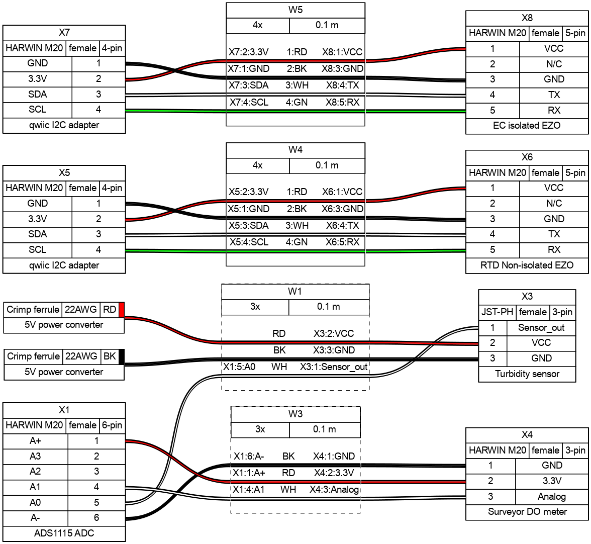

# Description


[firmware-setup.md](docs/firmware-setup.md)



[usage-maintenance.md](usage-maintenance.md)



[page-1.md](docs/page-1.md)



##

To pull CAD files install git LFS [https://git-lfs.com/](https://git-lfs.com/)

## BOM

### Custom cables

command for generating image from main dir

```
wireviz -f p -o docs/.gitbook/assets/ hardware/analog_harness.yaml
```

<figure><figcaption></figcaption></figure>


## Useful links / References

<details>

<summary>SparkFun Thing Plus - ESP32 WROOM (USB-C)</summary>

* Sparkfun [https://www.sparkfun.com/products/20168](https://www.sparkfun.com/products/20168)
* Schematic [https://cdn.sparkfun.com/assets/5/9/7/4/1/SparkFun\_Thing\_Plus\_ESP32-WROOM\_C\_schematic2.pdf](https://cdn.sparkfun.com/assets/5/9/7/4/1/SparkFun\_Thing\_Plus\_ESP32-WROOM\_C\_schematic2.pdf)
* Graphical datasheet [https://cdn.sparkfun.com/assets/3/9/5/f/e/SparkFun\_Thing\_Plus\_ESP32\_WROOM\_C\_graphical\_datasheet2.pdf](https://cdn.sparkfun.com/assets/3/9/5/f/e/SparkFun\_Thing\_Plus\_ESP32\_WROOM\_C\_graphical\_datasheet2.pdf)
* GitHub Hardware repositore with firmware test for hardware features [https://github.com/sparkfun/SparkFun\_Thing\_Plus\_ESP32\_WROOM\_C](https://github.com/sparkfun/SparkFun\_Thing\_Plus\_ESP32\_WROOM\_C)

</details>

<details>

<summary>SparkFun Pressure Sensor Breakout - MS5803-14BA</summary>

* Sparkfun [https://www.sparkfun.com/products/12909](https://www.sparkfun.com/products/12909)
* Schematic - [https://cdn.sparkfun.com/datasheets/Sensors/Weather/MS5803-14BA\_Breakout\_v10.pdf](https://cdn.sparkfun.com/datasheets/Sensors/Weather/MS5803-14BA\_Breakout\_v10.pdf)
* Datasheet [https://cdn.sparkfun.com/datasheets/Sensors/Weather/ms5803\_14ba.pdf](https://cdn.sparkfun.com/datasheets/Sensors/Weather/ms5803\_14ba.pdf)

</details>

<details>

<summary>ADS115 Adafruit</summary>

* downloads [https://learn.adafruit.com/adafruit-4-channel-adc-breakouts/downloads](https://learn.adafruit.com/adafruit-4-channel-adc-breakouts/downloads)
* Pinouts [https://learn.adafruit.com/adafruit-4-channel-adc-breakouts/pinouts](https://learn.adafruit.com/adafruit-4-channel-adc-breakouts/pinouts)

</details>

<details>

<summary>Gravity: Analog Turbidity Sensor for Arduino</summary>

* DFRobot [https://www.dfrobot.com/product-1394.html](https://www.dfrobot.com/product-1394.html)
* DFRobot wiki [https://wiki.dfrobot.com/Turbidity\_sensor\_SKU\_\_SEN0189](https://wiki.dfrobot.com/Turbidity\_sensor\_SKU\_\_SEN0189)
* Sensor [https://dfimg.dfrobot.com/nobody/wiki/8e585d98aafe2bab22be39c5b68165c5.pdf](https://dfimg.dfrobot.com/nobody/wiki/8e585d98aafe2bab22be39c5b68165c5.pdf)
* Schematic [https://github.com/Arduinolibrary/DFRobot\_Turbidity\_sensor/blob/master/SEN0189%20Turbidity%20sensor%28V1.0%29%20schematic.pdf](https://github.com/Arduinolibrary/DFRobot\_Turbidity\_sensor/blob/master/SEN0189%20Turbidity%20sensor\(V1.0\)%20schematic.pdf)
* Probe [https://raw.githubusercontent.com/Arduinolibrary/DFRobot\_Turbidity\_sensor/master/Probe\_Dimension.png](https://raw.githubusercontent.com/Arduinolibrary/DFRobot\_Turbidity\_sensor/master/Probe\_Dimension.png)
* Adapter [https://raw.githubusercontent.com/Arduinolibrary/DFRobot\_Turbidity\_sensor/master/Adapter\_Dimension.png](https://raw.githubusercontent.com/Arduinolibrary/DFRobot\_Turbidity\_sensor/master/Adapter\_Dimension.png)

</details>

<details>

<summary>Gravity: Analog TDS Sensor/ Meter for Arduino</summary>

* DFRobot [https://www.dfrobot.com/product-1662.html](https://www.dfrobot.com/product-1662.html)
* DFRobot wiki [https://wiki.dfrobot.com/Gravity\_\_Analog\_TDS\_Sensor\_\_\_Meter\_For\_Arduino\_SKU\_\_SEN0244](https://wiki.dfrobot.com/Gravity\_\_Analog\_TDS\_Sensor\_\_\_Meter\_For\_Arduino\_SKU\_\_SEN0244)
* Schematic [https://raw.githubusercontent.com/Arduinolibrary/Gravity\_Analog\_TDS\_Sensor\_For\_Arduino/master/Analog%20TDS%20Sensor(V1.0)%20Schematic.pdf](https://raw.githubusercontent.com/Arduinolibrary/Gravity\_Analog\_TDS\_Sensor\_For\_Arduino/master/Analog%20TDS%20Sensor\(V1.0\)%20Schematic.pdf)
* Adapter layout [https://raw.githubusercontent.com/Arduinolibrary/Gravity\_Analog\_TDS\_Sensor\_For\_Arduino/master/Analog%20TDS%20Sensor(V1.0)%20Layout.pdf](https://raw.githubusercontent.com/Arduinolibrary/Gravity\_Analog\_TDS\_Sensor\_For\_Arduino/master/Analog%20TDS%20Sensor\(V1.0\)%20Layout.pdf)
* GitHub library [https://github.com/DFRobot/GravityTDS](https://github.com/DFRobot/GravityTDS)

</details>

<details>

<summary>PowerBoost 500 Basic - 5V USB Boost @ 500mA from 1.8V+</summary>

* Adafruit [https://www.adafruit.com/product/1903](https://www.adafruit.com/product/1903)
* Schematic [https://cdn-learn.adafruit.com/assets/assets/000/017/017/original/adafruit\_products\_tps61090.png?1401312193](https://cdn-learn.adafruit.com/assets/assets/000/017/017/original/adafruit\_products\_tps61090.png?1401312193)
* Datasheet [https://cdn-shop.adafruit.com/datasheets/tps61090.pdf](https://cdn-shop.adafruit.com/datasheets/tps61090.pdf)

</details>

<details>

<summary>Inline PT-1000 Temperature Kit</summary>

* AtlasScientific [https://atlas-scientific.com/kits/inline-temperature-kit/](https://atlas-scientific.com/kits/inline-temperature-kit/)
* EZO™ RTD Circuit Datasheet [https://files.atlas-scientific.com/EZO\_RTD\_Datasheet.pdf](https://files.atlas-scientific.com/EZO\_RTD\_Datasheet.pdf)
* PT-1000 Temperature Probe Datasheet [https://files.atlas-scientific.com/PT-1000-probe.pdf](https://files.atlas-scientific.com/PT-1000-probe.pdf)
* EZO™ Carrier Board Specsheet [https://files.atlas-scientific.com/EZO-carrier-board-non-isolated.pdf](https://files.atlas-scientific.com/EZO-carrier-board-non-isolated.pdf)
* Github I2C library [https://github.com/Atlas-Scientific/Ezo\_I2c\_lib](https://github.com/Atlas-Scientific/Ezo\_I2c\_lib)
* I2C Sample code [https://files.atlas-scientific.com/Ardunio-I2C-RTD-sample-code.pdf](https://files.atlas-scientific.com/Ardunio-I2C-RTD-sample-code.pdf)

</details>

<details>

<summary>Mini Conductivity K 1.0 Kit</summary>

* AtlasScientific [https://atlas-scientific.com/kits/mini-conductivity-k-1-0-kit/](https://atlas-scientific.com/kits/mini-conductivity-k-1-0-kit/)
* EZO™ Conductivity Circuit Datasheet [https://files.atlas-scientific.com/EC\_EZO\_Datasheet.pdf](https://files.atlas-scientific.com/EC\_EZO\_Datasheet.pdf)
* Mini Conductivity Probe K 1.0 Datasheet [https://files.atlas-scientific.com/Mini\_EC\_K\_1.0\_probe.pdf](https://files.atlas-scientific.com/Mini\_EC\_K\_1.0\_probe.pdf)
* Electrically Isolated EZO™ Carrier Board Datasheet [https://files.atlas-scientific.com/electrically-isolated-ezo-carrier-board.pdf](https://files.atlas-scientific.com/electrically-isolated-ezo-carrier-board.pdf)
* EZO™ Conductivity Accuracy Graph [https://files.atlas-scientific.com/conductivity\_accuracy\_graph.pdf](https://files.atlas-scientific.com/conductivity\_accuracy\_graph.pdf)
* Wiring Diagram [https://files.atlas-scientific.com/ezo-ec-wiringdiagram.pdf](https://files.atlas-scientific.com/ezo-ec-wiringdiagram.pdf)
* How to properly cut your probe cable [https://files.atlas-scientific.com/how-to-properly-cut-probe-cables.pdf](https://files.atlas-scientific.com/how-to-properly-cut-probe-cables.pdf)
* I2C sample code [https://files.atlas-scientific.com/Ardunio-I2C-EC-sample-code.pdf](https://files.atlas-scientific.com/Ardunio-I2C-EC-sample-code.pdf)
* EZO I2C Library [https://github.com/Atlas-Scientific/Ezo\_I2c\_lib](https://github.com/Atlas-Scientific/Ezo\_I2c\_lib)
* I2C mode selection [https://www.instructables.com/UART-AND-I2C-MODE-SWITCHING-FOR-ATLAS-SCIENTIFIC-E/](https://www.instructables.com/UART-AND-I2C-MODE-SWITCHING-FOR-ATLAS-SCIENTIFIC-E/)

</details>

<details>

<summary>Surveyor™ Analog Dissolved Oxygen Kit</summary>

* AtlasScientific [https://atlas-scientific.com/kits/surveyor-analog-do-kit/](https://atlas-scientific.com/kits/surveyor-analog-do-kit/)
* Surveyor™ Analog D.O. Meter Datasheet [https://files.atlas-scientific.com/Surveyor-DO-datasheet.pdf](https://files.atlas-scientific.com/Surveyor-DO-datasheet.pdf)
* Mini Lab Grade Dissolved Oxygen Probe Datasheet [https://files.atlas-scientific.com/Mini\_DO\_probe.pdf](https://files.atlas-scientific.com/Mini\_DO\_probe.pdf)
* Dissolved Oxygen | Common Mistakes | Air Bubble [https://youtu.be/1I1Sk9pt47c](https://youtu.be/1I1Sk9pt47c)
* Dissolved Oxygen | Common Mistakes | Stagnant vs Moving Water [https://youtu.be/d9zkxkv55SE](https://youtu.be/d9zkxkv55SE)
* Dissolved Oxygen | Common Mistakes | Damaged Membrane [https://youtu.be/PiXnvrTnVjs](https://youtu.be/PiXnvrTnVjs)
* Dissolved Oxygen Calculator [https://atlas-scientific.com/dissolved-oxygen-calculator](https://atlas-scientific.com/dissolved-oxygen-calculator)
* Arduino Sample Code [https://files.atlas-scientific.com/surveyor-DO-ardunio-code.pdf](https://files.atlas-scientific.com/surveyor-DO-ardunio-code.pdf)

</details>

<details>

<summary>Surveyor™ Analog pH Kit</summary>

* AtlastScientific [https://atlas-scientific.com/kits/surveyor-analog-ph-kit/](https://atlas-scientific.com/kits/surveyor-analog-ph-kit/)
* Surveyor™ Analog pH Sensor / Meter Datasheet [https://files.atlas-scientific.com/Surveyor-pH-datasheet.pdf](https://files.atlas-scientific.com/Surveyor-pH-datasheet.pdf)
* Consumer Grade pH Probe Datasheet [https://files.atlas-scientific.com/consumer-grade-pH-probe.pdf](https://files.atlas-scientific.com/consumer-grade-pH-probe.pdf)
* pH Temperature Compensation Calculator [https://atlas-scientific.com/ph-temperature-calculator/](https://atlas-scientific.com/ph-temperature-calculator/)
* Arduino Sample Code [https://files.atlas-scientific.com/surveyor-pH-ardunio-code.pdf](https://files.atlas-scientific.com/surveyor-pH-ardunio-code.pdf)
*

</details>

<details>

<summary>Surveyor™ Analog Isolator</summary>

* AtlasScientific [https://atlas-scientific.com/carrier-boards/surveyor-analog-isolator/](https://atlas-scientific.com/carrier-boards/surveyor-analog-isolator/)
* Surveyor™ Analog Isolator Datasheet [https://files.atlas-scientific.com/Surveyor\_analog\_isolator\_datasheet.pdf](https://files.atlas-scientific.com/Surveyor\_analog\_isolator\_datasheet.pdf)
* Arduino Sample Code [https://files.atlas-scientific.com/atlas\_surveyor.zip](https://files.atlas-scientific.com/atlas\_surveyor.zip)
* Surveyor™ Analog Isolator 3D model (\*step) [https://files.atlas-scientific.com/ISO-Gravity.zip](https://files.atlas-scientific.com/ISO-Gravity.zip)

</details>
