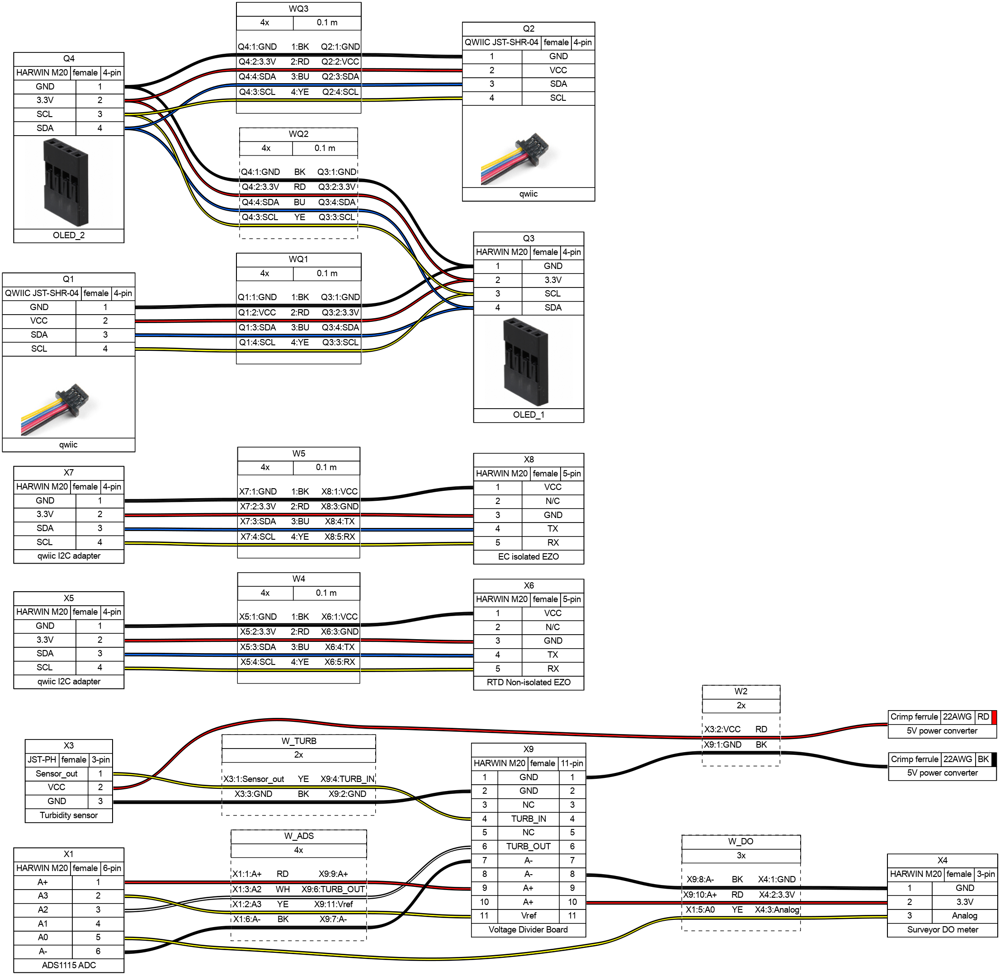

# Description


[firmware-setup.md](docs/firmware-setup.md)



[usage-maintenance.md](usage-maintenance.md)



[page-1.md](docs/page-1.md)



##

To pull CAD files install git LFS [https://git-lfs.com/](https://git-lfs.com/)

## BOM

### Custom cables

command for generating image from main dir

```
wireviz -f p -o docs/.gitbook/assets/ hardware/analog_harness.yaml
```

<figure><figcaption></figcaption></figure>

