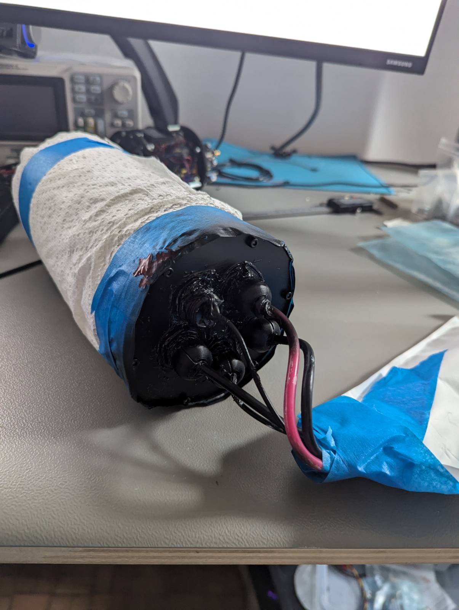
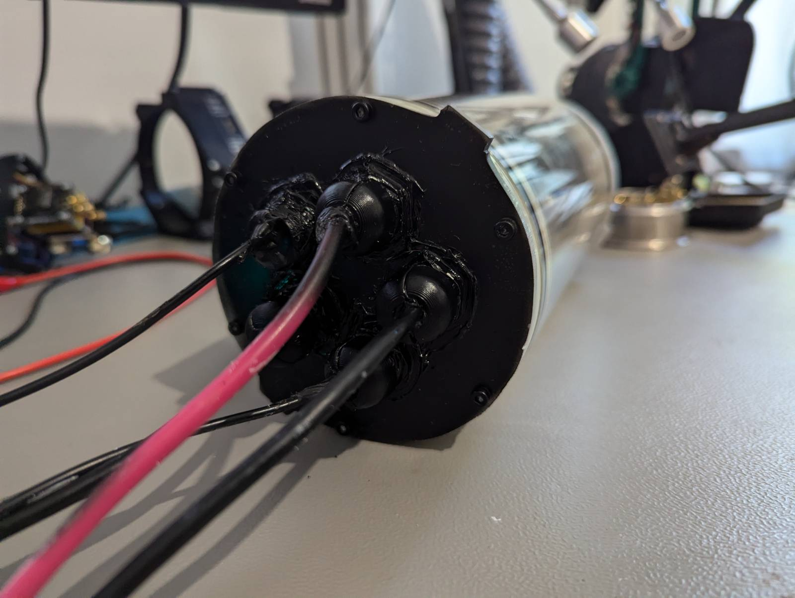
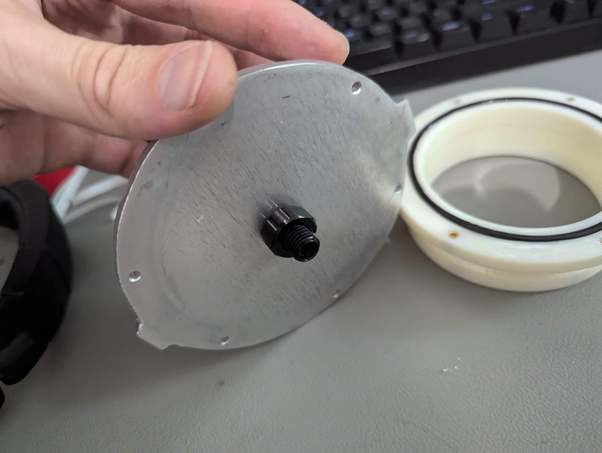
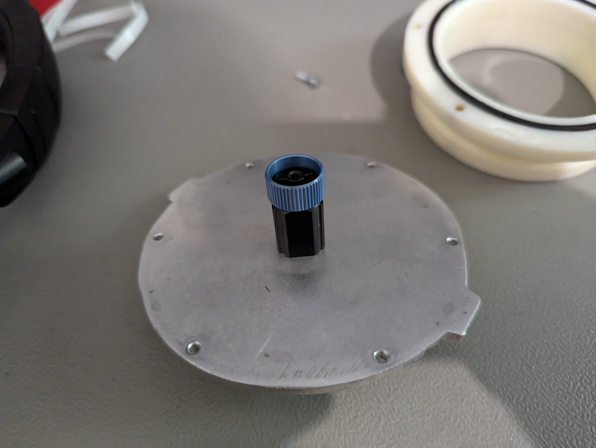
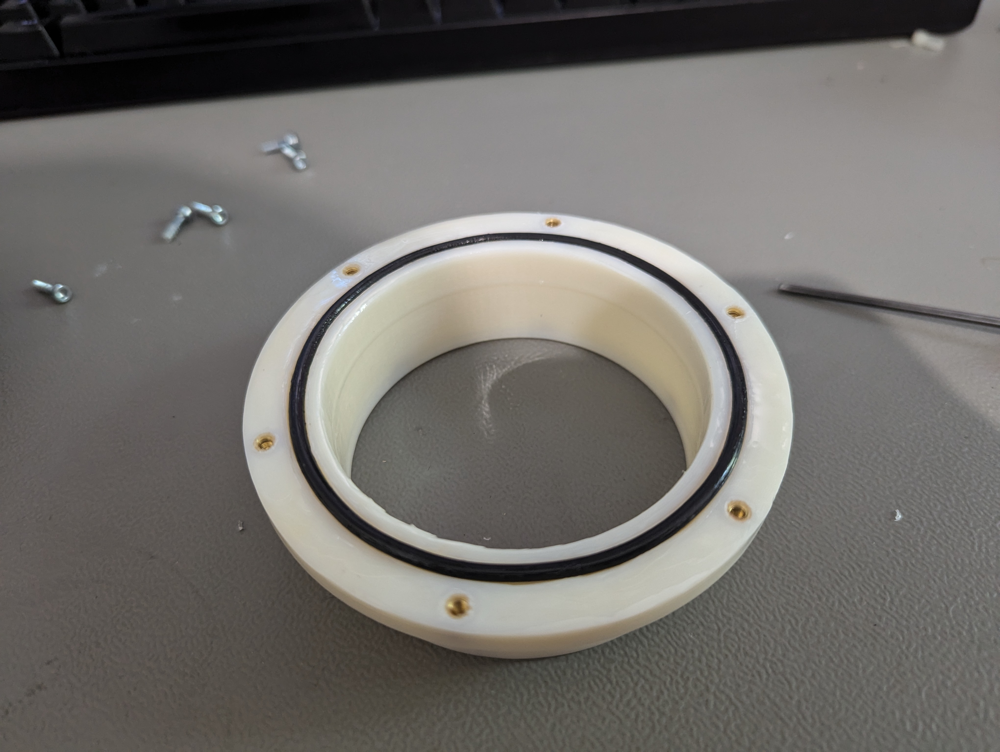
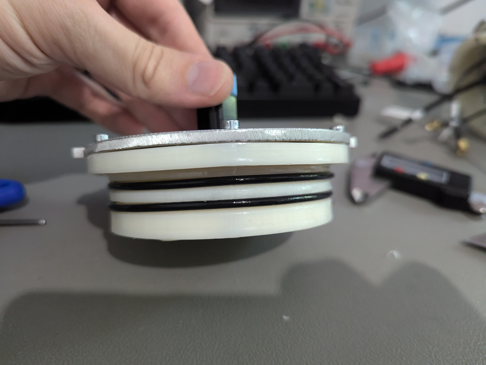
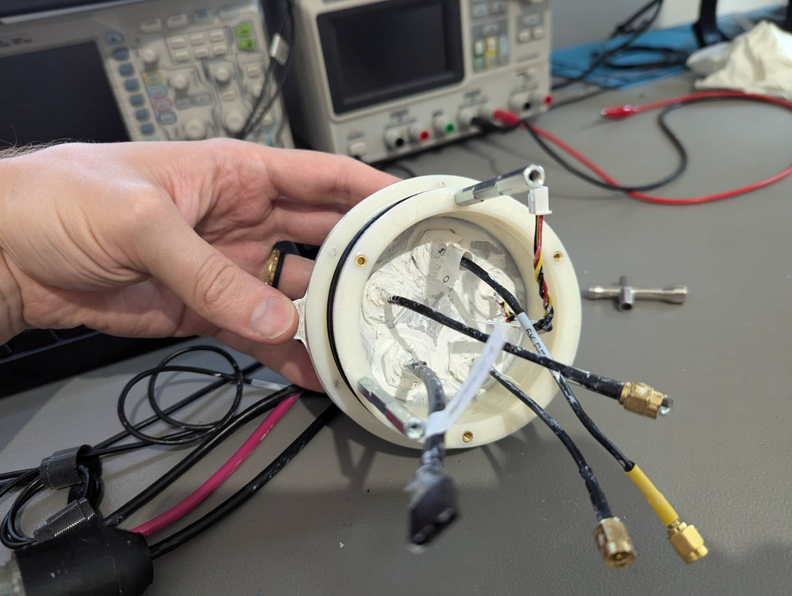
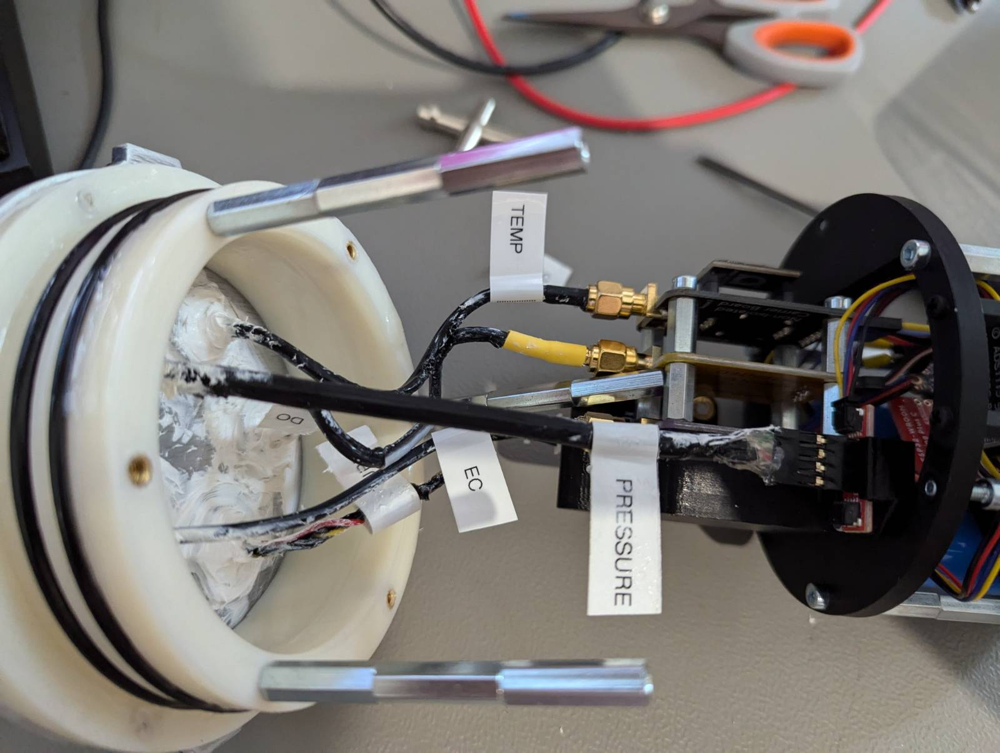
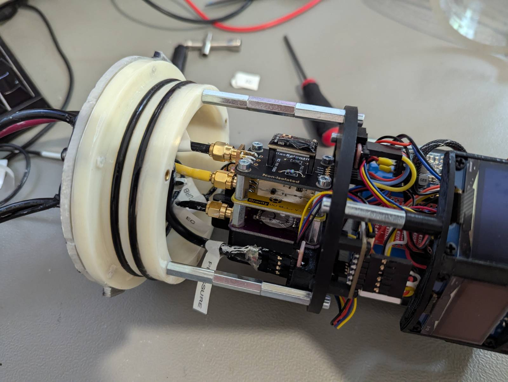

# External assembly

## Tube clamps

1. Fix 2x Top clamps with the handle with 2x M3x10 screws
2. Fix Clamps around the tube with 8x M3x10 Screws

<figure><figcaption></figcaption></figure>

 

<figure><figcaption></figcaption></figure>

<figure><figcaption></figcaption></figure>

 

<figure><figcaption></figcaption></figure>

 

<figure><figcaption></figcaption></figure>

## Switch

1. Insert magnet into the slider
2. Insert spring to the switch casing
3. Insert slider to the switch casing
4. Install switch holders on bottom clamp with 2x M3x10 screws
5. Mount switch casing on the holders with 4x M3x10 screws

<figure><figcaption></figcaption></figure>

 

<figure><figcaption></figcaption></figure>

 

<figure><figcaption></figcaption></figure>

<figure><figcaption></figcaption></figure>

 

<figure><figcaption></figcaption></figure>

<figure><figcaption></figcaption></figure>

## Sensor holder and cover

1. Cut neoprene rubber piece to cover most of the are unsuring mounting holes are covered
2. Using 5x M3x6 screw fix if the the sensor holder
3. Cut a cross in each sensor holder location
4. Install sensor holder to the sensor cover
5. Prepare knobs
   1. Insert M3x20 Hex head bolts into the knobs
   2. User nut from the oposite side to pull it out

<figure><figcaption></figcaption></figure>

 

<figure><figcaption></figcaption></figure>

<figure><figcaption></figcaption></figure>

 

<figure><figcaption></figcaption></figure>

 

<figure><figcaption></figcaption></figure>

<figure><figcaption></figcaption></figure>

 

<figure><figcaption></figcaption></figure>

 

<figure><figcaption></figcaption></figure>

## Flanges

### Install cable glands

Flange colored black indicates the starting point, going clock wise. Surface with more deformities should be on the top. Order for installation:

1. RTD temp
2. Pressure
3. EC
4. Turb
5. OD

Steps:

1. Clean the cable gland threads&#x20;
2. Add Sikaflex 291i sealant around the threads&#x20;
3. Install the gland and tighten it. Would need 20 and 19mm Wrenches to hold.
4. Clean up excess sealant&#x20;
5. (optional) spray paint black for cleaner look

<figure><figcaption></figcaption></figure>

 

<figure><figcaption></figcaption></figure>

### Install Pressure relief valve

Indepth instructions follow here [https://bluerobotics.com/learn/pressure-relief-valve-installation-and-usage/](https://bluerobotics.com/learn/pressure-relief-valve-installation-and-usage/)

And for simpler vent [https://bluerobotics.com/learn/wte-vent-assembly-guide/](https://bluerobotics.com/learn/wte-vent-assembly-guide/)

1. Lubricate the o-ring
2. Install the pressure relief valve

<figure><figcaption></figcaption></figure>

 

<figure><figcaption></figcaption></figure>

### Install aluminium lids&#x20;

1. Lubricate the o-rings
2. Lubricate the channel
3. Insert all 6x  M3x10 screws but just to find the slot
4. Tighten all screws in a star pattern
   1. Don't over-tighten
   2. There might seem that there is a gap, but 3D printed part has a slight bend at the edge. Also, the o-ring doesn't compresss completely.
5. Repeat for both sensors cable gland side and pressure relief side.

<figure><figcaption></figcaption></figure>

 

<figure><figcaption></figcaption></figure>

### Install O-rings to Flanges

1. Lubricate o-rings 90mm ID o-rings with grease
2. Lubricate the channel
3. Install on the sides

<figure><figcaption></figcaption></figure>

### Connecting Flange with Electronics

1. Install 3x3x M3x20mm standoffs
   1. Note position relating the flange lip
2. Connect sensors&#x20;
3. Connect standoffs with mounting ring with 3x M3x10mm screws

<figure><figcaption></figcaption></figure>

 

<figure><figcaption></figcaption></figure>

 

<figure><figcaption></figcaption></figure>

### Install sensor to the Sensor holder

Install sensor flange, Ensure switch lines up

Mount sensor cover

Install pressure relief valve flange

Test power switch

