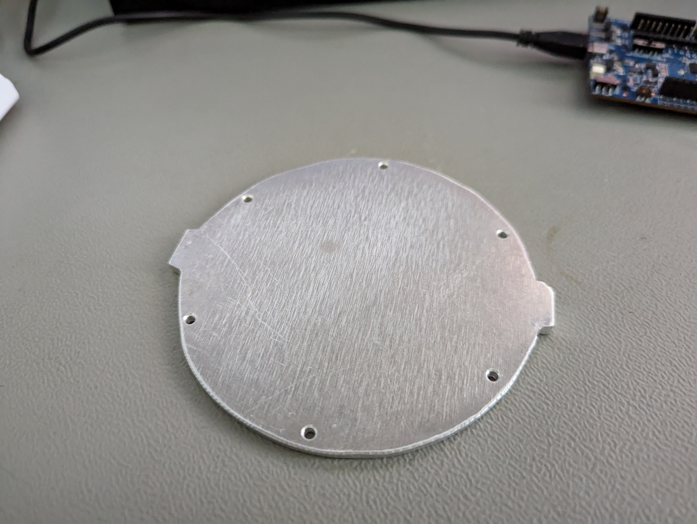
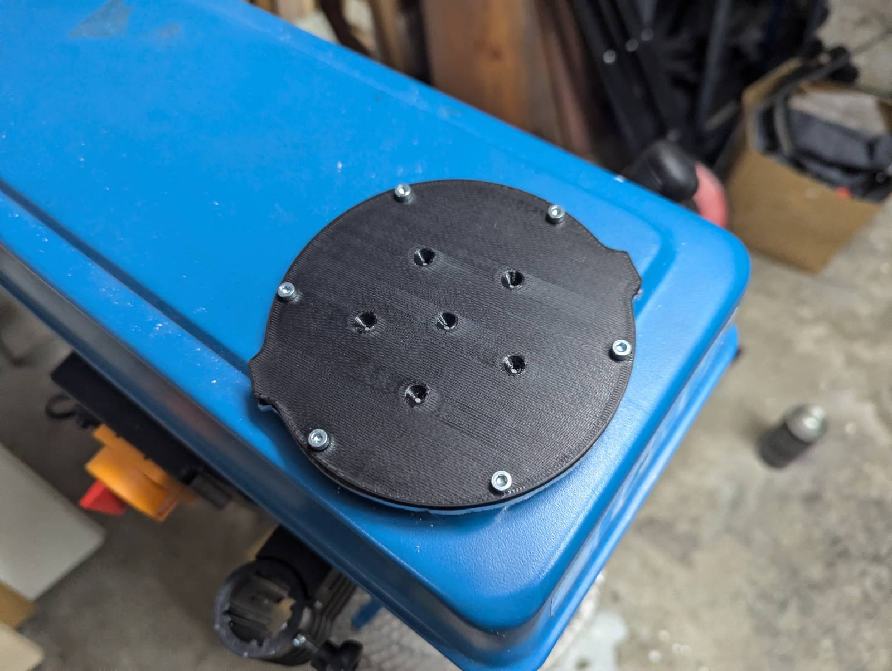
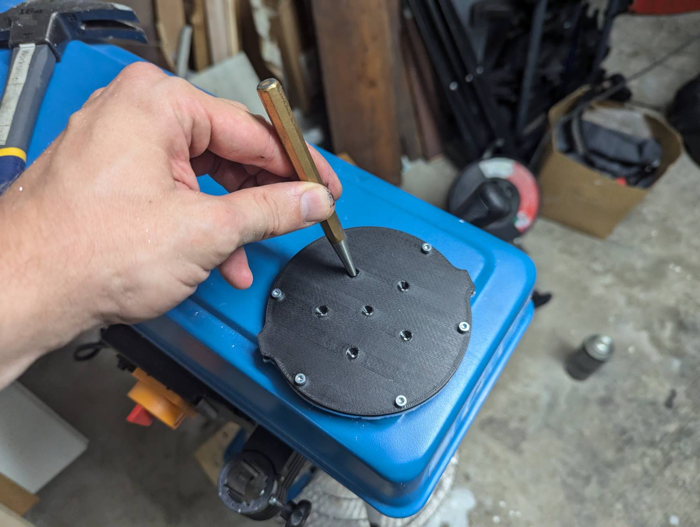
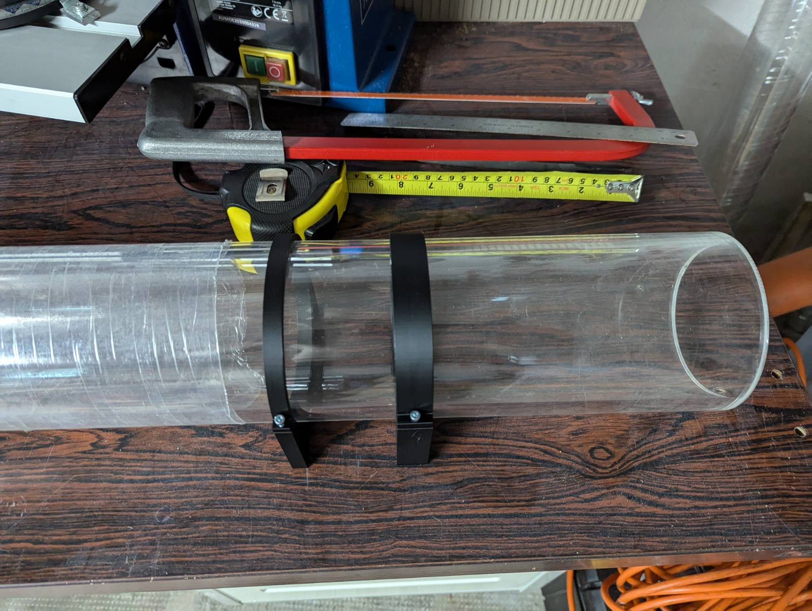
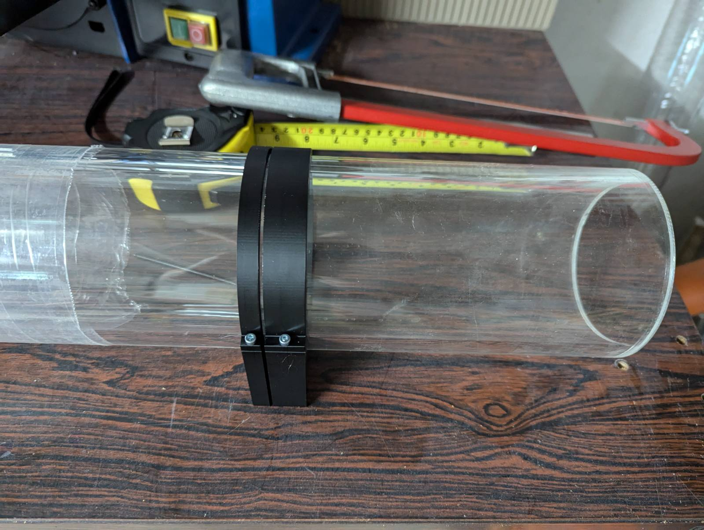
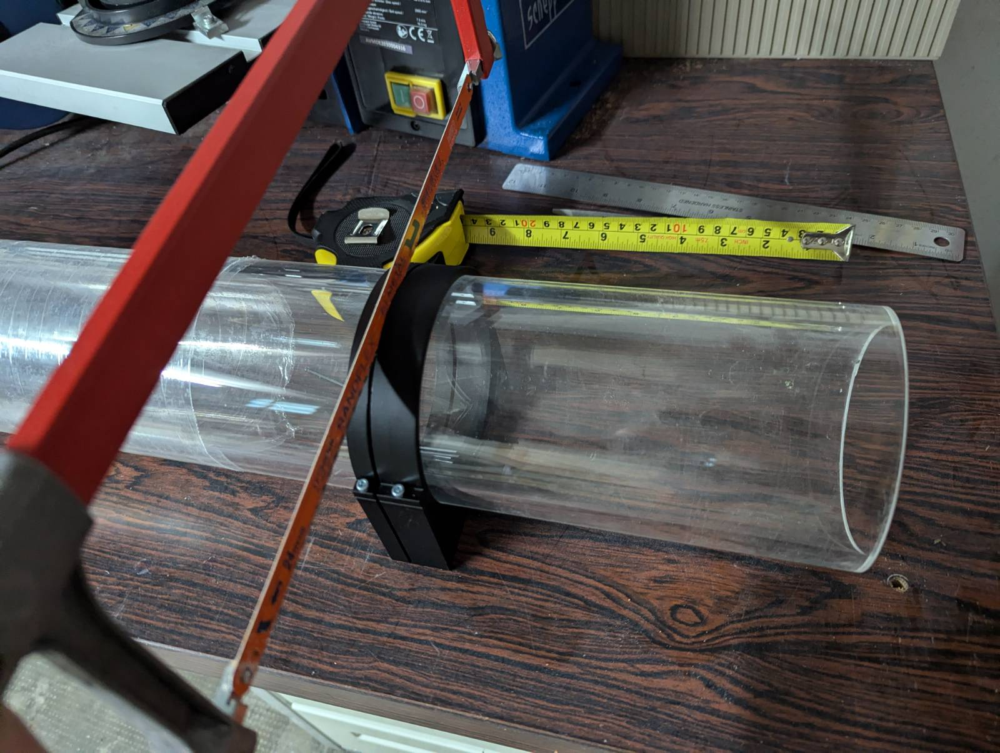

# Hardware

## 3D printing

Slicing done with PrusaSlicer [https://www.prusa3d.com/page/prusaslicer\_424/](https://www.prusa3d.com/page/prusaslicer\_424/)

### Internal components

<figure><figcaption>
Orientation
</figcaption></figure>

1. ConnectingRingTop
2. ConnectingRingBottom
3. VD\_holder
4. BatteryHolder\_v004
5. ReedSwitchHolder

* Material - PETG
* Default settings for
  * 0.2mm speed
  * Generic PETG
* Infill - 100%

<figure><figcaption></figcaption></figure>

 

<figure><figcaption></figcaption></figure>

 

<figure><figcaption></figcaption></figure>

1. SensorStackAttachment
2. Display\_holder\_1.3

* Material - PETG
* Default settings for
  * 0.2mm speed
  * Generic PETG
* Infill - 100%
* Add smart fill support as shown in images

<figure><figcaption></figcaption></figure>


Cable clamp inner diameter needs to be adjusted to each individual cable size before exporting STL.


* Filename: 5x **o-ring-protection** and 10x **CableGland\_cableclamp**
* Material: PETG
* Default settings for 0.2
* Infill - 100%
* Perimeter - 4

### External components

<figure><figcaption>
Orientation Handle_curved
</figcaption></figure>

* **Handle\_curved**
  * Filament - PETG
  * Default settings for
    * 0.2mm speed
    * Generic PETG
  * Infill - 100%
  * Add Brim 7mm

<figure><figcaption></figcaption></figure>

* 2x **Clamp\_top** and 2x **Clamp\_bottom**
  * Material: PETG
  * Default settings for
    * 0.2mm speed
  * Infill - 100%

<figure><figcaption></figcaption></figure>

* Filename: knob
* Material: PETG
* Default settings for 0.2
* Infill - 100%
* Perimeter - 4
* Brim (optional)

<figure><figcaption></figcaption></figure>

* Filename: SensorCover
* Material: PETG
* Default settings for 0.2
* Infill - 100%
* Perimeter - 4

<figure><figcaption></figcaption></figure>

* Filename: SensorMountingPlate
* Material: PETG
* Default settings for 0.2
* Infill - 100%
* Perimeter - 4

### Sealing Flanges

<figure><figcaption></figcaption></figure>


Before exporting STL,  measure inside tube diameter and adjust spreadsheet value for flange\_from\_tube to be around 0.6mm smaller than inner diameter. Default inner diameter value is 94mm. flange\_from\_tube value is to compensate from actual tolerances. \
Example, if real inner diamter is 95mm, make flange\_from\_tube to 0.2mm, if real inner diameter is 93mm, make flange from tube -0.8mm.&#x20;


* Material: PC blend (natural color)
* Default settings for 0.2 Layer height
  * Perimeter - 6
  * Infill - 100%
  * Brim
    * Width - 20mm
    * Type - Outer and inner brim

### Switch

<figure><figcaption></figcaption></figure>

* Filename: **SwitchSpring** and **SwitchHolder**, **SwitchHolder Mirror**
* Material: PETG
* Default settings for 0.2
* Infill - 100%
* Perimeter - 4

<figure><figcaption></figcaption></figure>

 

<figure><figcaption></figcaption></figure>

* Filename: **SwitchLid\_withText**
* Material: PETG
* Default settings for 0.2
* Infill - 100%
* Perimeter - 4
* Dual color
  * Black external
  * White text and arrows

<figure><figcaption></figcaption></figure>

* Filename: **Switchslider\_withText**
* Material: PETG
* Default settings for 0.2
* Infill - 100%
* Perimeter - 4
* Dual color
  * White main color
  * Black text

##

## Post-processing

### Cleaning up 3D prints

* Debur any parts with brim
* Using a sharp chisel remove any parts required support
* Using a torch lighter remove any stringing if present

### Heat inserts

Parts that require heat inserts

All heatinserts are for M3, insert height is 5.7mm.

* 2xFlangeSeal\_Open
  * 6x top
  * 6x bottom
  * 
* 2xClamp bottom
  * 4x sides, insert from the bottom
  * 2x on 45degree angle, insert from outside
  * 
* 2xClamp top
  * 3x top
  * 2x on 45degree angle, insert from outside
  * 
* Sensor mounting plate
  * 4x sides
  * 
* SwitchHolder and SwitchHolder\_mirror
  * 2x top
  * 

### Coating

## Lids cutting

### Main shape

1.  3D print templates

    1. EndCap\_holePunch
    2. EndCap\_sensorHoles

    
2.  Punch 6 mounting holes

    
3.  Drill mounting holes

    
4.  Add template to mark outline

    
5. Cut outline
6. Debur mounting holes
7. Sand and polish edges

<figure><figcaption></figcaption></figure>

### Sensors and Pressure relief valve modifications

Use the same template for each version

<figure><figcaption></figcaption></figure>

 

<figure><figcaption></figcaption></figure>

* Sensor side&#x20;
  * Punch 5 holes around the center
  * Drill with 16 mm step drill
  * Debur edges
* Pressure relief side
  * Punch 1 center hole
  * Drill with 10mm drill
  * Debur edges

## Tube cutting

1. (Optional) 3D print clamps for guiding the hacksaw
   1. File names-
      1. TubeCuttingClampRoundA
      2. TubeCuttingClampRoundB
      3. TubCuttingHolder
2. Measure 20cm length
3. Add guide clamps
4. Cut
5. Debur inside edges

<table data-card-size="large" data-view="cards"><thead><tr><th></th><th></th><th></th><th data-hidden data-card-cover data-type="files"></th></tr></thead><tbody><tr><td></td><td></td><td></td><td></td></tr><tr><td></td><td></td><td></td><td></td></tr><tr><td></td><td></td><td></td><td></td></tr><tr><td></td><td></td><td></td><td></td></tr><tr><td></td><td></td><td></td><td></td></tr></tbody></table>

