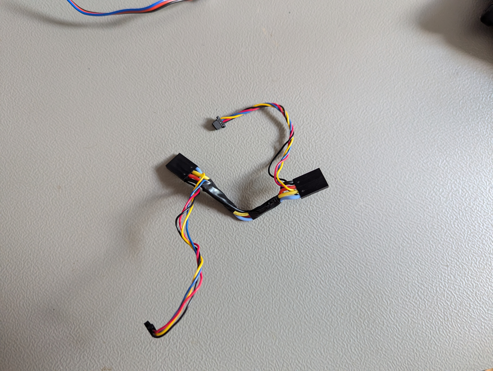
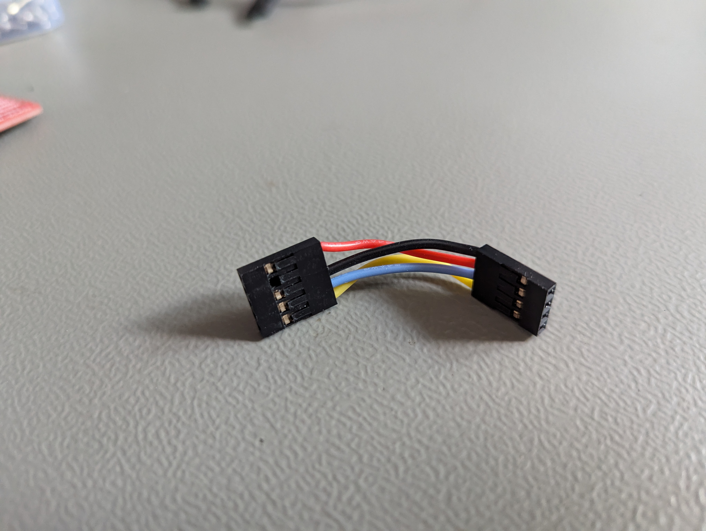
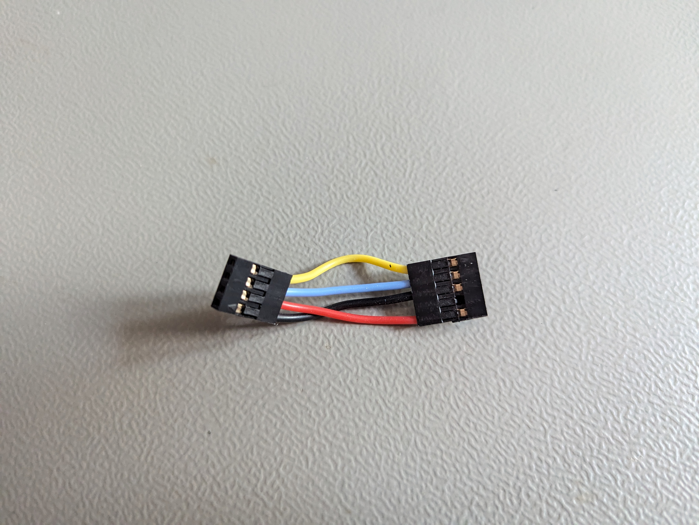
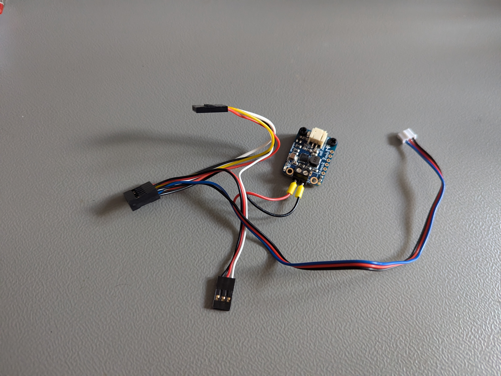
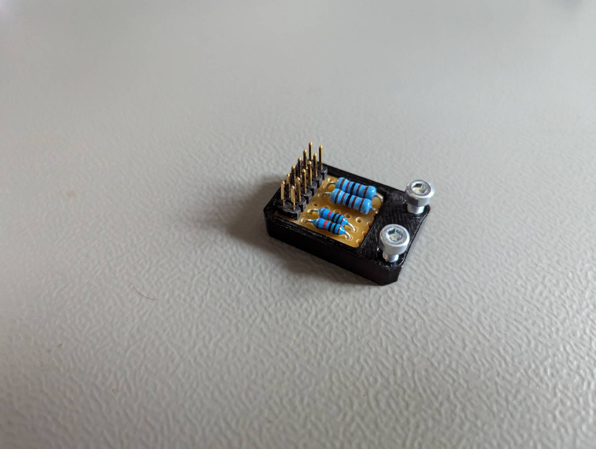
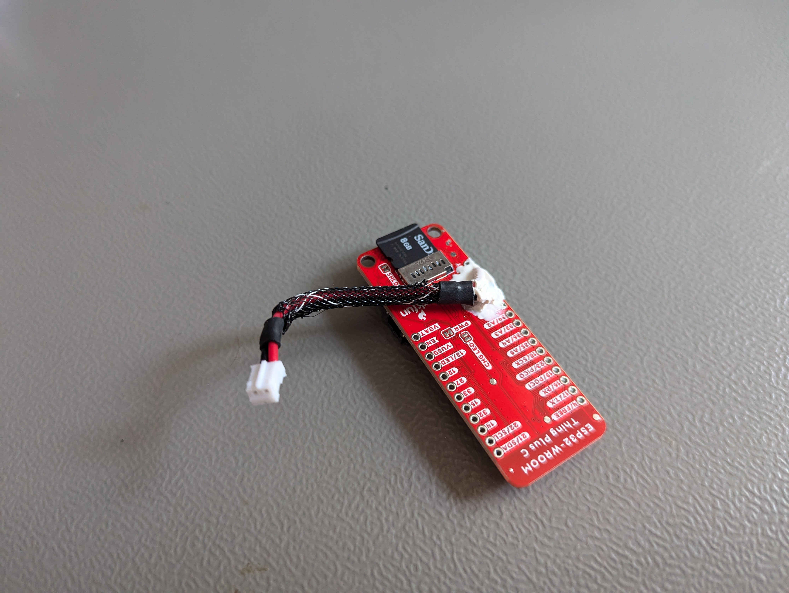
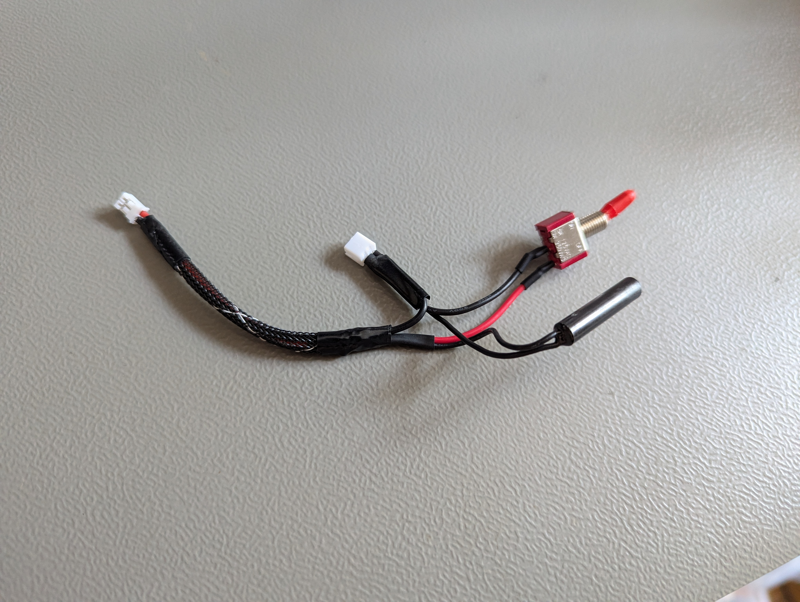

# Electronics wiring

## Custom cables

command for generating image from main directory

```
wireviz -f p -o docs/.gitbook/assets/ hardware/analog_harness.yaml
```

<figure><figcaption></figcaption></figure>

## Prepared cables

Cable images from top to down from cable plan

<figure><figcaption></figcaption></figure>

<div>

<figure><figcaption></figcaption></figure>

 

<figure><figcaption></figcaption></figure>

</div>

<figure><figcaption></figcaption></figure>

## Turbidity voltage divider

<figure><figcaption></figcaption></figure>

Stepping down turbidity output from around 3.5-4.2V to 1.75-2.1V.

Differential negative input is 1.65V. Using ADS1115 gain of 4. Measuring difference between 1.65-2.674V

<figure><figcaption></figcaption></figure>

Pinout is of X9 connector in cable schematic. Extra pins used to daisy chain power wires.

## OLED displays I2C address change

<figure><figcaption></figcaption></figure>

Solder address resistor to the right to change default address of 0x78 to 0x7A. This should be done on the OLED on the right side (left side from the back view like the photo)

## ESP32 3V output to 5V converter

<figure><figcaption></figcaption></figure>

Solder 3V3 and GND pins to the JST female connector. Add hot glue or liquid tape to prevent wires from bending and breaking.&#x20;

## Power switch cable

<figure><figcaption></figcaption></figure>

<figure><figcaption></figcaption></figure>

Cable connecting the battery (female) to the ESP32 (male). GND connects directly, power side goes through toggle switch and reed switch in parallel. \
Reed switch is to be controller via external magnet outside the enclosure, but if for any reason it fails and for debugging additional toggle switch is added that can also turn on the device.

