# Final assembly

## Inside electronics

### Sensor stack

1. Add EZOisolated EC board to SensorStackHolder
2. Mount 4x 12mm standoffs
3. Add Dissolved oxygen board
4. Mount 4x 12mm standoffs
5. Mount Non isolated Ezo board and 4x  M3x6 screw to fix it
6. Mount 2x 6mm standoffs on the side
7. Install Turbidity breakout with 2x M3x6 bolts

<figure>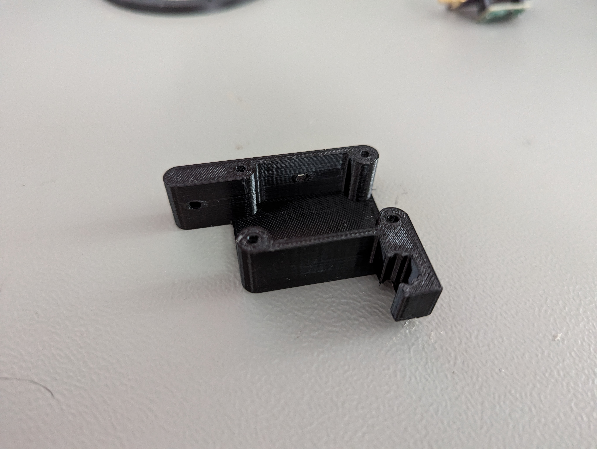<figcaption></figcaption></figure>

 

<figure>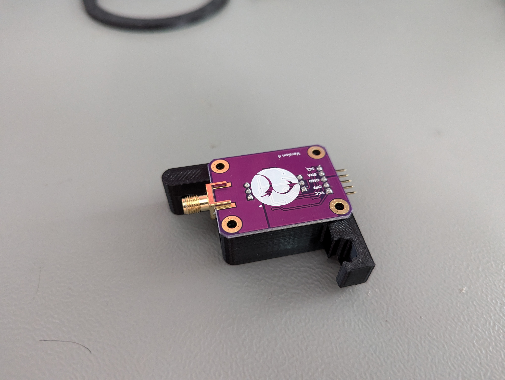<figcaption></figcaption></figure>

<figure>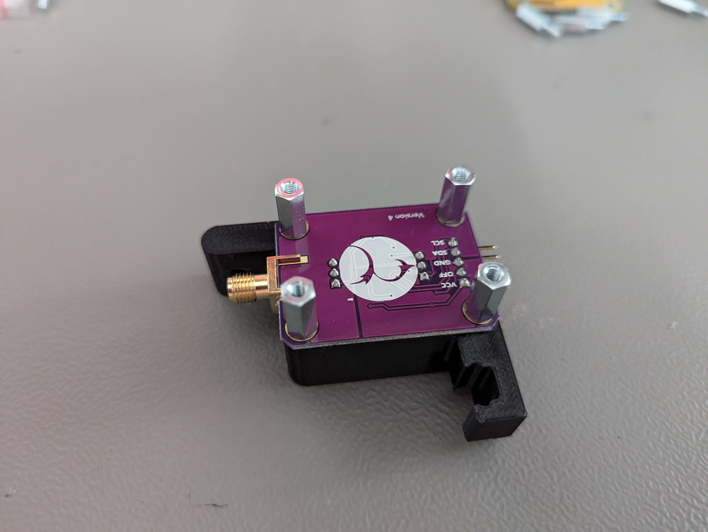<figcaption></figcaption></figure>

 

<figure>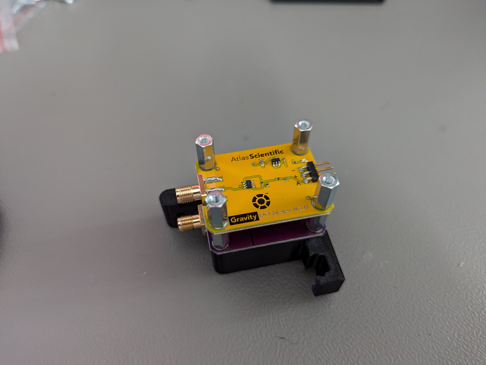<figcaption></figcaption></figure>

<figure>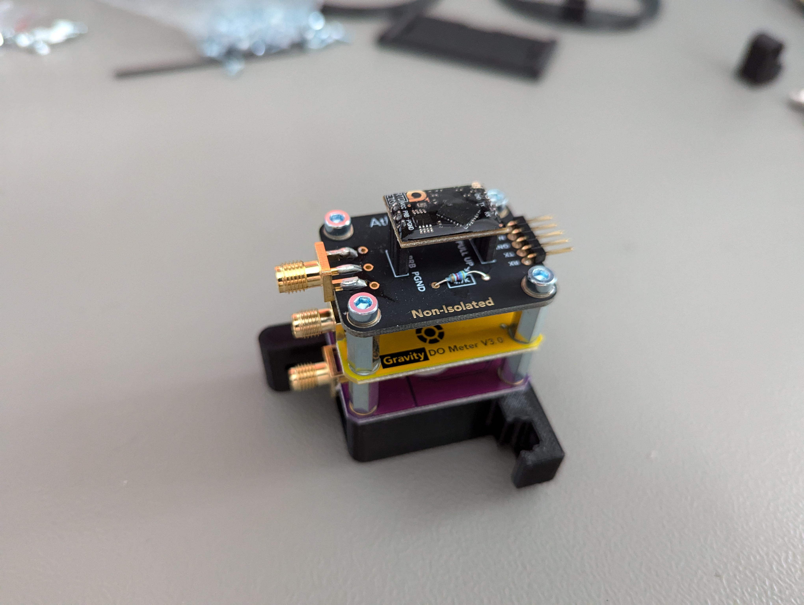<figcaption></figcaption></figure>

 

<figure>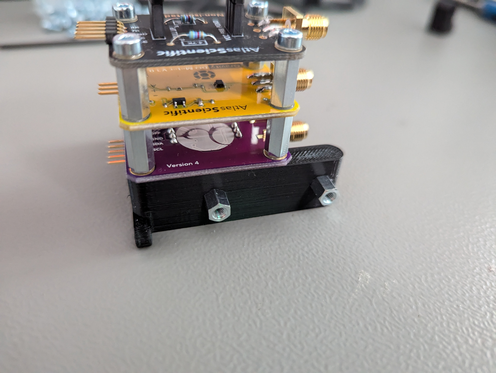<figcaption></figcaption></figure>

<figure>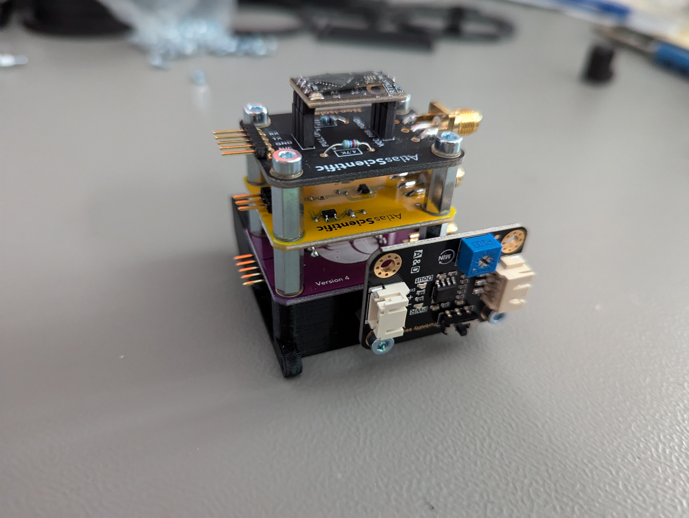<figcaption></figcaption></figure>

### Bottom ring

1. Install 2x M2.5x6mm Nylon standoffs on the ring
2. Add ADS1115 and fix it with bolts
3. Slide in 2x Qwiic adapter boards
4. Pre assemle 2x M3x10 mounting screws to SensorAttachmentHolder
5. Install SensorAttachmentHolder to the bottom ring
6. Slide in Qwiic adapter board to the SensorAttachmentHolder

<figure>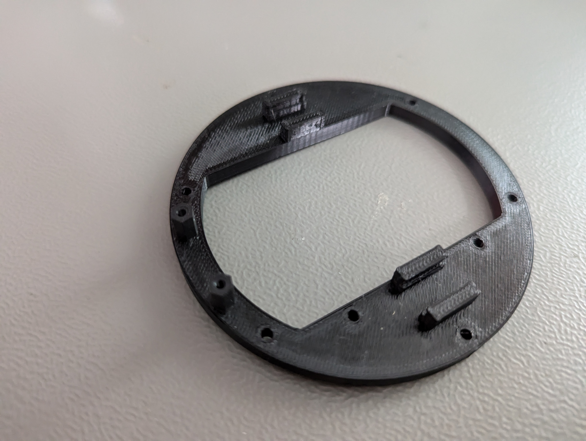<figcaption></figcaption></figure>

 

<figure>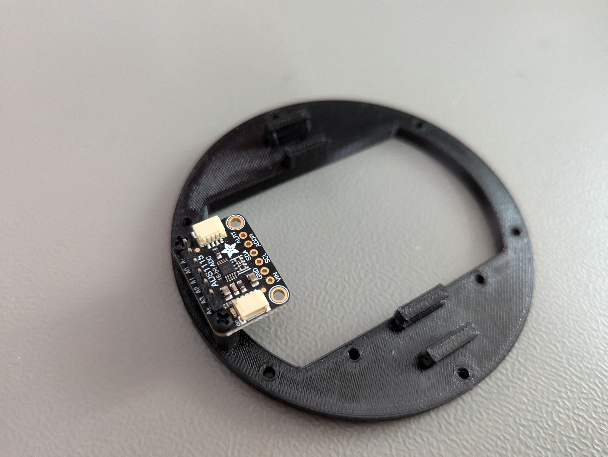<figcaption></figcaption></figure>

<figure>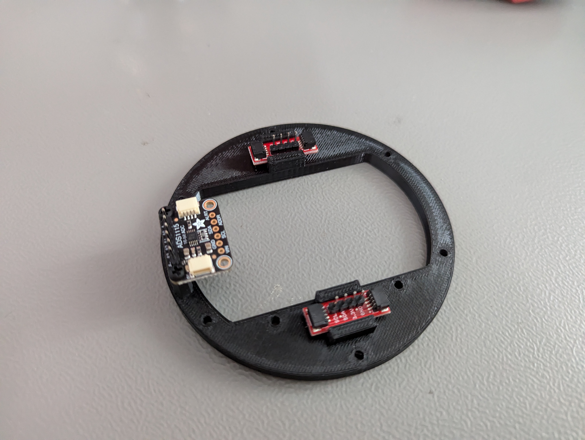<figcaption></figcaption></figure>

 

<figure>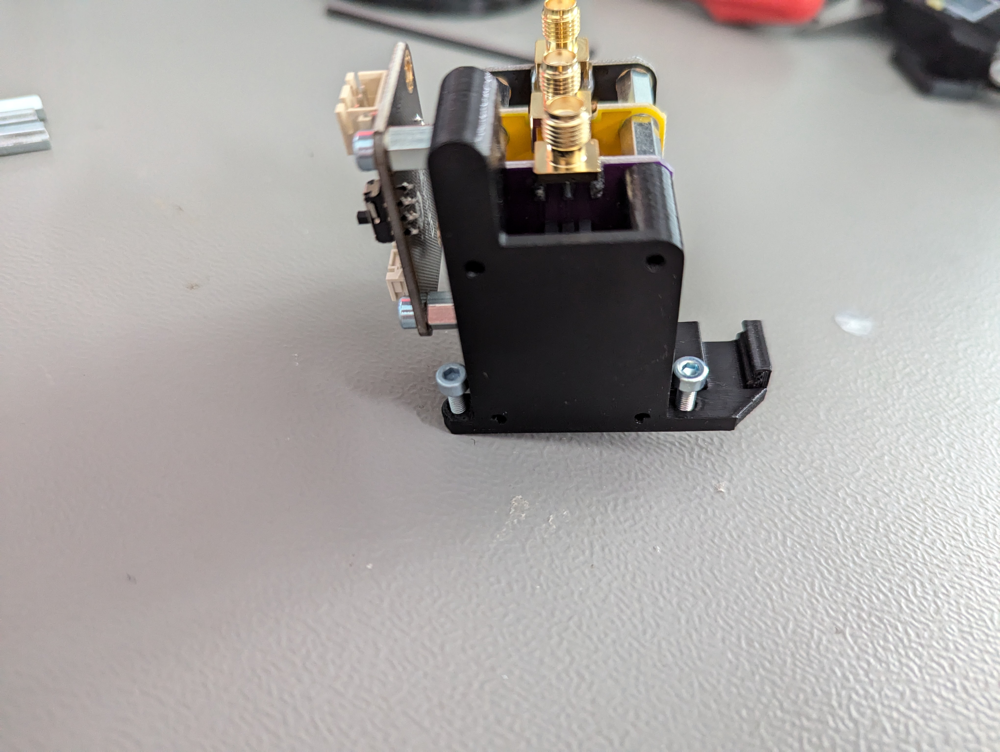<figcaption></figcaption></figure>

<figure>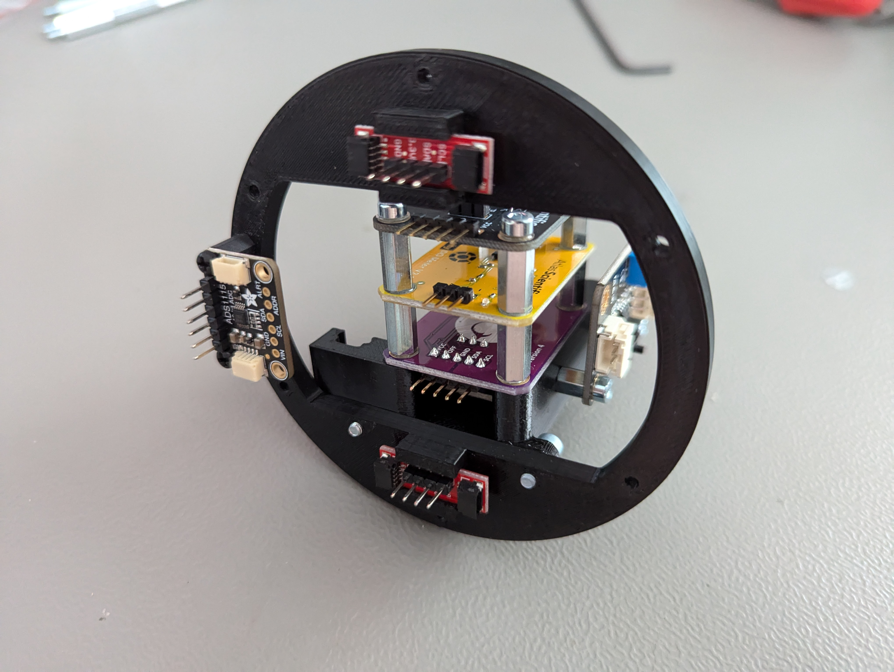<figcaption></figcaption></figure>

 

<figure>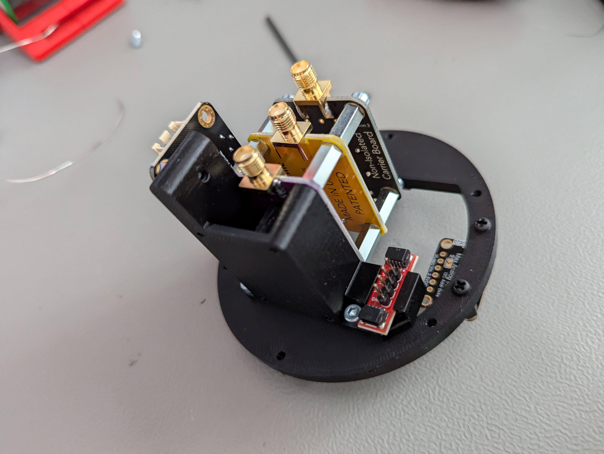<figcaption></figcaption></figure>

###

###

### Top Ring

