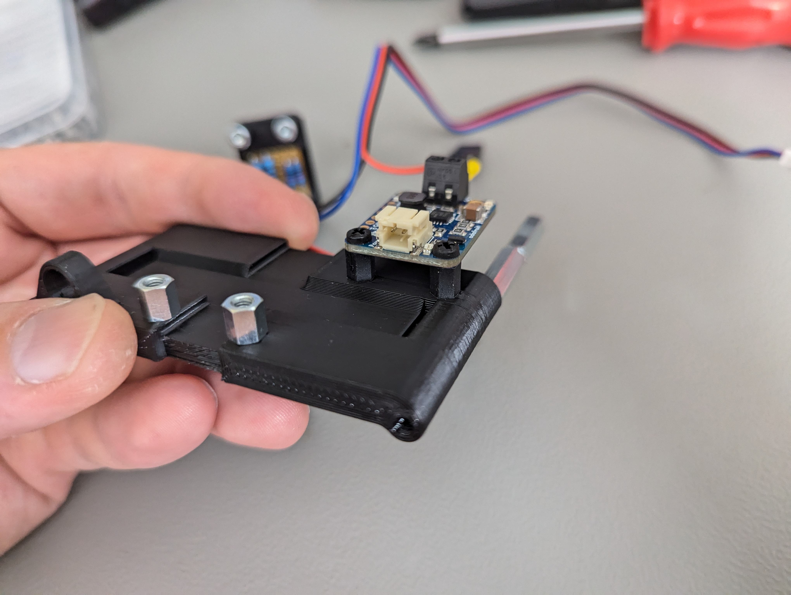
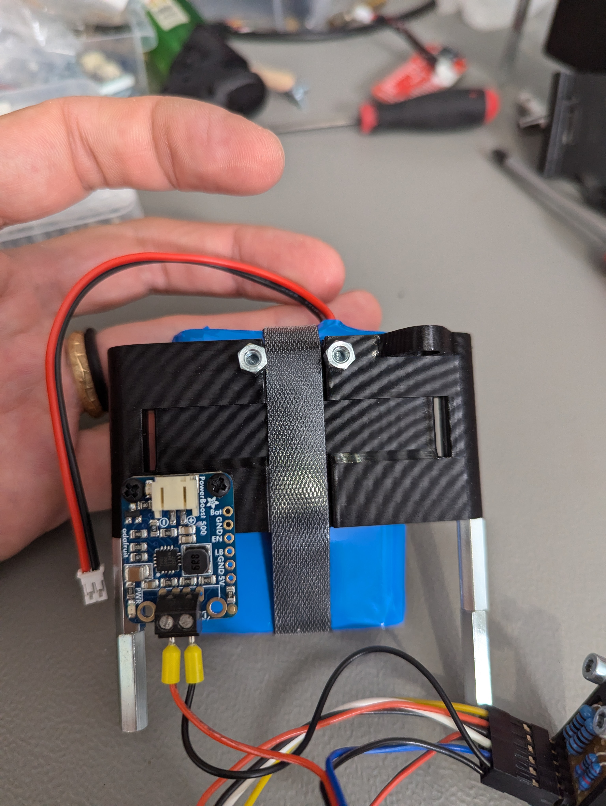
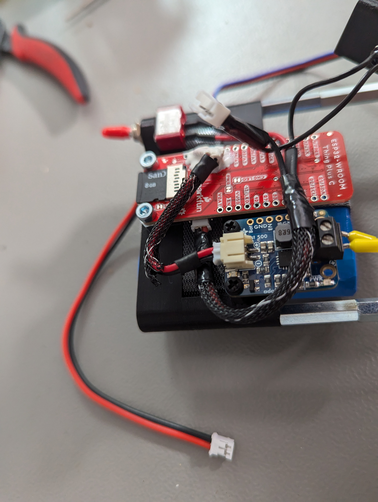
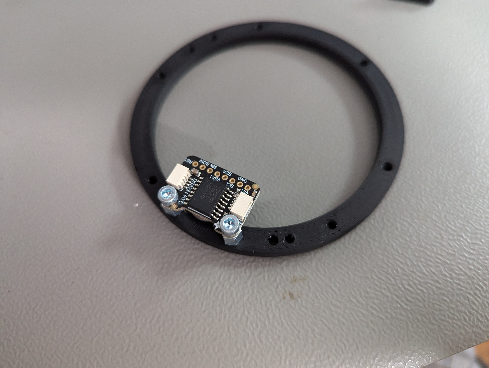
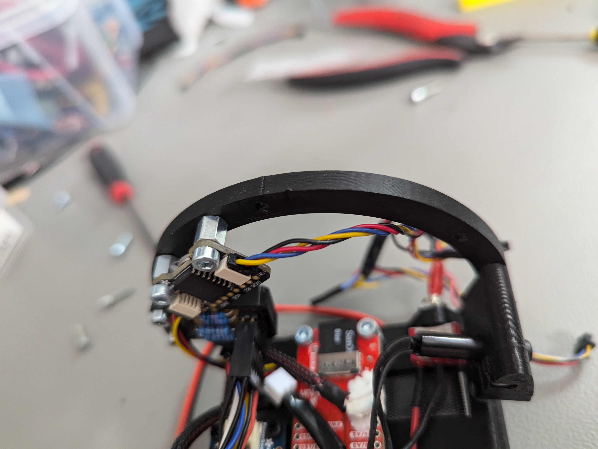
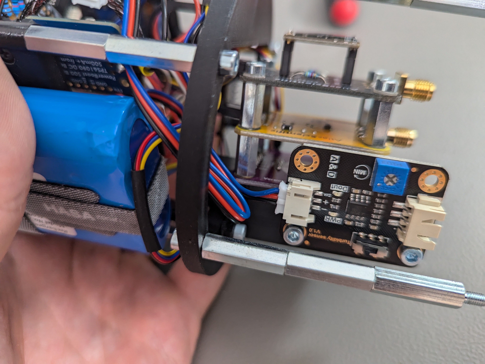

# Inside Electronics

## Sensor stack

1. Add EZOisolated EC board to SensorStackHolder
2. Mount 4x 12mm standoffs
3. Add Dissolved oxygen board
4. Mount 4x 12mm standoffs
5. Mount Non isolated Ezo board and 4x  M3x6 screw to fix it
6. Mount 2x 6mm standoffs on the side
7. Install Turbidity breakout with 2x M3x6 bolts

<figure><figcaption></figcaption></figure>

 

<figure><figcaption></figcaption></figure>

<figure><figcaption></figcaption></figure>

 

<figure><figcaption></figcaption></figure>

<figure><figcaption></figcaption></figure>

 

<figure><figcaption></figcaption></figure>

<figure><figcaption></figcaption></figure>

## Bottom ring

1. Install 2x M2.5x6mm Nylon standoffs on the ring
2. Add ADS1115 and fix it with bolts
3. Slide in 2x Qwiic adapter boards
4. Pre assemle 2x M3x10 mounting screws to SensorAttachmentHolder
5. Install SensorAttachmentHolder to the bottom ring
6. Slide in Qwiic adapter board to the SensorAttachmentHolder

<figure><figcaption></figcaption></figure>

 

<figure><figcaption></figcaption></figure>

<figure><figcaption></figcaption></figure>

 

<figure><figcaption></figcaption></figure>

<figure><figcaption></figcaption></figure>

 

<figure><figcaption></figcaption></figure>

1. Connect 2x EZOboards to Qwiic adapters with W4, W5 custom cables
2. Connect I2C interface using qwiic connectors in this order:
   1. Pressure sensor qwiic to ADS1115
      1. 50mm Cable
   2. ADS1115 tp Qwiicc adapter for EZO EC
      1. 50mm cable
   3. Qwiic adapter for EZO EC to EZO RTD
      1. 100mm cable

<figure><figcaption></figcaption></figure>

 

<figure><figcaption></figcaption></figure>

<figure><figcaption></figcaption></figure>

 

<figure><figcaption></figcaption></figure>

 

<figure><figcaption></figcaption></figure>

## Battery holder

1. Install 4x M3 20mm standoffs on the sides
2. Install 2x M3 6mm standoffs for ESP32
3. Install M2.5 Nylon screws and standoffs
4. Assemble voltage converter
5. Install battery using velco or zip ties
6. Install ESP32
7. Connect 3.3V cable to power converter
8. Install power switch, tighten well
9. Connect power input to ESP32

<figure><figcaption></figcaption></figure>

 

<figure><figcaption></figcaption></figure>

<figure><figcaption></figcaption></figure>

 

<figure><figcaption></figcaption></figure>

 

<figure><figcaption></figcaption></figure>

<figure><figcaption></figcaption></figure>

 

<figure><figcaption></figcaption></figure>

 

<figure><figcaption></figcaption></figure>

 

<figure><figcaption></figcaption></figure>

<figure><figcaption></figcaption></figure>

 

<figure><figcaption></figcaption></figure>

<figure><figcaption></figcaption></figure>

 

<figure><figcaption></figcaption></figure>

## OLED displays

1. Install OLED displays into the holder
   1. 8x M2.5 6mm screws with 8x nuts
   2. Ensure screen position is correct
      1. Looking from the back
         1. 0x7A is left
         2. 0x78 is righ
2. Install 20mm standoff

<figure><figcaption></figcaption></figure>

 

<figure><figcaption></figcaption></figure>

<figure><figcaption></figcaption></figure>

 

<figure><figcaption></figcaption></figure>

<figure><figcaption></figcaption></figure>

## Top Ring

1. Install RTC on the top ring
   1. 2x 6mm standoffs
   2. 2x M3x6mm screws
2. Install voltage divider 2x6mm screws
3. Connect battery holder to top ring, 2x M3x10mm screws
4. Connect Voltage connector (note orientation)
5. Connect Qwiic connector from RTC to ESP32, 50mm qwiic cable
6. Assemble reed switch inside it's holder. Using square nut and M3x10 screw
7. Install reed switch holder to the top ring 2x M3x10&#x20;
8. Connect OLED qwiic cable to RTC'
9. Install OLED display holder
10. Connect both displays

<figure><figcaption></figcaption></figure>

 

<figure><figcaption></figcaption></figure>

<figure><figcaption></figcaption></figure>

<figure><figcaption></figcaption></figure>

 

<figure><figcaption></figcaption></figure>

<figure><figcaption></figcaption></figure>

 

<figure><figcaption></figcaption></figure>

 

<figure><figcaption></figcaption></figure>

<figure><figcaption></figcaption></figure>

 

<figure><figcaption></figcaption></figure>

 

<figure><figcaption></figcaption></figure>

## Assembling rings

1. Install Top ring on bottom ring
   1. Fasten with 3x M3x10 screw from the bottom of the bottom ring
2. Install connector to ADS1115 note the orientation
3. Connect dissolved oxygen cable to the breakout, note orientation
4. Connect turbidity cable to the turbidity breakout board
5. Connect OLED display Qwiic cable to qwiic adapter for RTD

<figure><figcaption></figcaption></figure>

 

<figure><figcaption></figcaption></figure>

 

<figure><figcaption></figcaption></figure>

<figure><figcaption></figcaption></figure>

 

<figure><figcaption></figcaption></figure>

 

<figure><figcaption></figcaption></figure>

 

<figure><figcaption></figcaption></figure>

