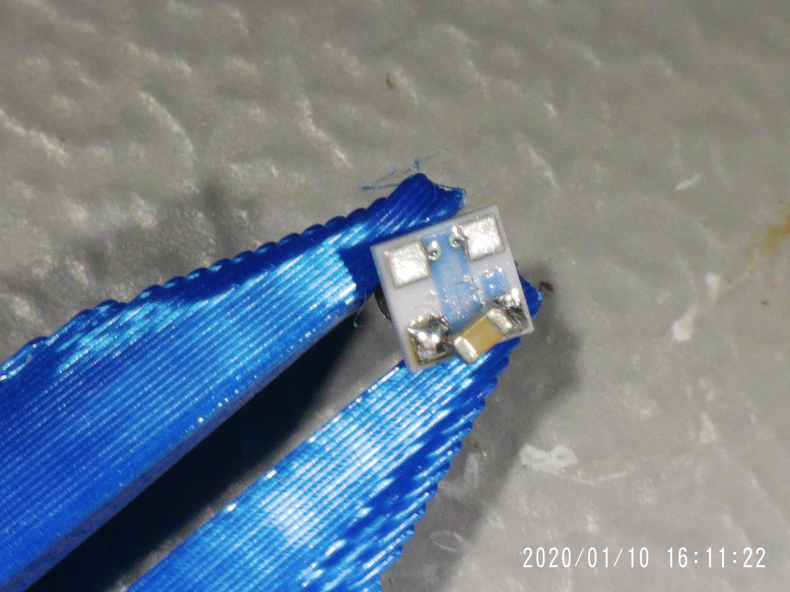

# Sensors

## Pressure

MS583730BA01-50

**Components**

* Sensor [https://www.digikey.it/en/products/detail/te-connectivity-measurement-specialties/MS583730BA01-50/5629501?s=N4IgTCBcDaILIGUCsAOAzAdjQBgEIEFsBGAWiWxAF0BfIA](https://www.digikey.it/en/products/detail/te-connectivity-measurement-specialties/MS583730BA01-50/5629501?s=N4IgTCBcDaILIGUCsAOAzAdjQBgEIEFsBGAWiWxAF0BfIA)
* 3D printed
  * MS583730BA01-50-Enclosure\_inner
  * MS583730BA01-50- Enclosure\_outer
* Cable&#x20;
* SMD 0.1uF Capacitor
* o-ring
* Flexible Urethane 8800
  * Syringe to inject liquid inside casing

**Steps**

*   3D print

    * 6 Layer walls
    * 100% infill
    * PETG

    

<!---->

* Solder capacitor and cable

* Apply conformal coating on soldering
* Install o-ring to sensor
* Clean cable with IPA
* Insert sensor to casing

* Mount external casing

* Apply tape on the end to prevent leaking

* Fill casing with Urethane (using syringe)

* Cure it

MS580314BA01-00

**Components**

* Sensor
* 3D printed
  * MS580314BA01-00-Enclosure\_inner
  * MS580314BA01-00 - Enclosure\_outer
* Cable
* Flexible Urethane 8800

**Steps**

* 3D print
  * 6 Layer walls
  * 100% infill
  * PETG

* Solder capacitor and cable
* Apply conformal coating
* Clean cable with IPA
* Insert sensor to casing

* Mount external casing
* Apply tape to prevent Urethane leaking

* Fill casing with Urethane
* Cure itdone

## Turbidity sensor

* Sensor [https://www.dfrobot.com/product-1394.html](https://www.dfrobot.com/product-1394.html)
* 3D print Casing
  * Turbidity\_Cover
  * 6 Layer wall
  * 100% infill
  * 10mm Brim width
  * PETG

<figure><figcaption></figcaption></figure>

* Desolder JST connector

<figure><figcaption></figcaption></figure>

 

<figure><figcaption></figcaption></figure>

* Solder the cable
  * Red - VCC
  * Black - GND
  * Green - Signal

<figure><figcaption></figcaption></figure>

* Hot Glue the wires to keep them in place
* Fill hot glue around sensor are to seal it, preventing Urethane filling sensor are

<figure><figcaption></figcaption></figure>

* Install casing
* Fill with Urethane

<figure><figcaption></figcaption></figure>

## Temperature

### PCB assembly

### EZOboard I2C mode selection

### Calibration

## Dissolved Oxygen

## Conductivity

