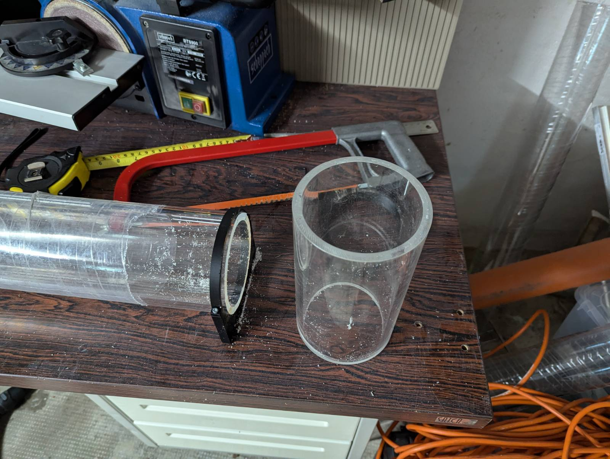

# Copy of Assembly


## Sensors

### Pressure

<details>

<summary>MS583730BA01-50</summary>

**Components**

* Sensor [https://www.digikey.it/en/products/detail/te-connectivity-measurement-specialties/MS583730BA01-50/5629501?s=N4IgTCBcDaILIGUCsAOAzAdjQBgEIEFsBGAWiWxAF0BfIA](https://www.digikey.it/en/products/detail/te-connectivity-measurement-specialties/MS583730BA01-50/5629501?s=N4IgTCBcDaILIGUCsAOAzAdjQBgEIEFsBGAWiWxAF0BfIA)
* 3D printed
  * MS583730BA01-50-Enclosure\_inner
  * MS583730BA01-50- Enclosure\_outer
* Cable&#x20;
* SMD 0.1uF Capacitor
* o-ring
* Flexible Urethane 8800
  * Syringe to inject liquid inside casing

**Steps**

*   3D print

    * 6 Layer walls
    * 100% infill
    * PETG

    

<!---->

* Solder capacitor and cable


* Apply conformal coating on soldering
* Install o-ring to sensor
* Clean cable with IPA
* Insert sensor to casing


* Mount external casing


* Apply tape on the end to prevent leaking


* Fill casing with Urethane (using syringe)


* Cure it


</details>

<details>

<summary>MS580314BA01-00</summary>

**Components**

* Sensor
* 3D printed
  * MS580314BA01-00-Enclosure\_inner
  * MS580314BA01-00 - Enclosure\_outer
* Cable
* Flexible Urethane 8800

**Steps**

* 3D print
  * 6 Layer walls
  * 100% infill
  * PETG


* Solder capacitor and cable
* Apply conformal coating
* Clean cable with IPA
* Insert sensor to casing


* Mount external casing
* Apply tape to prevent Urethane leaking


* Fill casing with Urethane
* Cure itdone


</details>


### Turbidity sensor

* Sensor [https://www.dfrobot.com/product-1394.html](https://www.dfrobot.com/product-1394.html)
* 3D print Casing
  * Turbidity\_Cover
  * 6 Layer wall
  * 100% infill
  * 10mm Brim width
  * PETG

<figure><figcaption></figcaption></figure>

* Desolder JST connector

<div>

<figure><figcaption></figcaption></figure>

 

<figure><figcaption></figcaption></figure>

</div>

* Solder the cable
  * Red - VCC
  * Black - GND
  * Green - Signal

<figure><figcaption></figcaption></figure>

* Hot Glue the wires to keep them in place
* Fill hot glue around sensor are to seal it, preventing Urethane filling sensor are

<figure><figcaption></figcaption></figure>

* Install casing
* Fill with Urethane

<figure><figcaption></figcaption></figure>

## Electronics wiring


### Custom cables

command for generating image from main dir

```
wireviz -f p -o docs/.gitbook/assets/ hardware/analog_harness.yaml
```

<figure><figcaption></figcaption></figure>


## Enclosure


## 3D printing

Slicing done with PrusaSlicer [https://www.prusa3d.com/page/prusaslicer\_424/](https://www.prusa3d.com/page/prusaslicer\_424/)

### Internal components

<figure><figcaption><p>Orientation</p></figcaption></figure>

1. ConnectingRingTop
2. ConnectingRingBottom
3. VD\_holder
4. BatteryHolderV2
5. SensorStackAttachment


* Filament - PETG
* Default settings for
  * 0.2mm speed
  * Generic PETG
* Infill - 100%

### External components

<figure><figcaption><p>Orientation Handle_curved</p></figcaption></figure>

* **Handle\_curved**
  * Filament - PETG
  * Default settings for
    * 0.2mm speed
    * Generic PETG
  * Infill - 100%
  * Add Brim 7mm

<figure><figcaption></figcaption></figure>

* **Clamp\_top** and **Clamp\_bottom**
  * Filament - PETG
  * Default settings for
    * 0.2mm speed
    * Generic PETG
  * Infill - 100%


### Tube cutting

1. (Optional) 3D print clamps for guiding the hacksaw
   1. File names-
      1. TubeCuttingClampRoundA
      2. TubeCuttingClampRoundB
      3. TubCuttingHolder
2. Measure 20cm length
3. Add guide clamps
4. Cut
5. Debur inside edges

<table data-card-size="large" data-view="cards"><thead><tr><th></th><th></th><th></th><th data-hidden data-card-cover data-type="files"></th></tr></thead><tbody><tr><td></td><td></td><td></td><td></td></tr><tr><td></td><td></td><td></td><td></td></tr><tr><td></td><td></td><td></td><td></td></tr><tr><td></td><td></td><td></td><td></td></tr><tr><td></td><td></td><td></td><td></td></tr></tbody></table>

